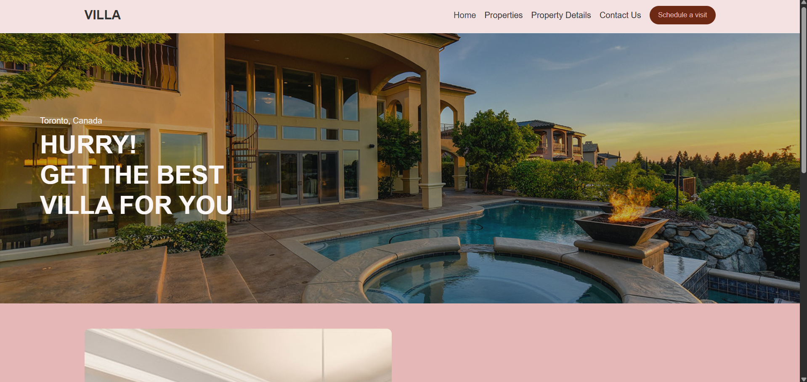

# 🏡 Villa Real Estate Landing Page

Welcome to the **Villa Real Estate** landing page! This is a stylish, responsive real estate website built with **HTML** and **CSS**. Perfect for showcasing luxury properties, this template is ideal for real estate agents, property managers, or developers looking for a clean and modern layout.  

---

## 🌟 Features

- 📱 **Responsive Design** — Mobile-friendly layout for all screen sizes  
- 🖼️ **Hero Section** — Eye-catching full-screen banner with text overlay  
- 🏠 **Featured Property Section** — Highlight key property details and features  
- 🎨 **Custom Styling** — Elegant color palette with modern typography  
- 🧭 **Navigation Bar** — Simple and clean navigation with a "Schedule a visit" button  

---

## 📸 Screenshot




---
## 🚀 Getting Started

To run this project locally:

1. Clone the repository or download the ZIP file.
2. Open the `index.html` file in your browser.

```bash
git clone https://github.com/yourusername/villa-real-estate.git
cd villa-real-estate
open index.html

---

📁 File Structure

villa-real-estate/
├── index.html         # Main HTML file
├── style.css          # Styling (CSS)
├── script.js          # JavaScript (empty or for future use)

---

🛠️ Customization
Replace the hero banner image and featured image with your own property photos.

Adjust the color scheme in style.css to match your brand identity.

Add links to your real properties or connect with a backend for dynamic listings.